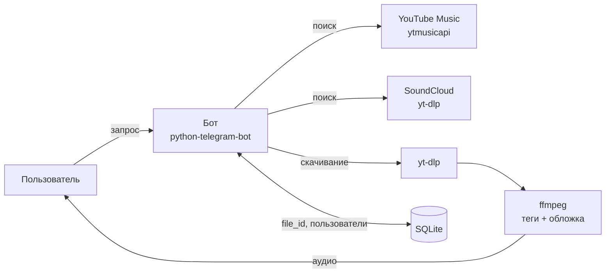

# bakermusic

Telegram-бот для поиска и скачивания музыки из **YouTube Music** и **SoundCloud**.
Пишешь название трека или имя артиста, выбираешь из выдачи, получаешь аудиофайл с обложкой и тегами.

Пет-проект: минималистичный интерфейс и упор на скорость.

<!-- Добавьте скриншот: положите картинку в docs/ и раскомментируйте строку ниже -->
<!-- <p align="center"></p> -->

## Возможности

- **Два источника** — YouTube Music и SoundCloud, переключение одной кнопкой под выдачей.
- **Только музыка.** Поиск идёт по разделу «Песни» YouTube Music, поэтому в выдаче нет стримов, влогов и интервью.
- **Обложки.** Квадратная обложка показывается в карточке Telegram и вшита в файл, так что видна и в любом плеере.
- **Чистые теги.** Исполнитель и название без `(Official Video)`, `[Lyrics]` и прочего мусора.
- **Быстро:**
  - файл не перекодируется, если источник отдаёт AAC или MP3 (только перепаковка, в ~10 раз быстрее);
  - уже отправленные треки приходят мгновенно из кэша Telegram (`file_id`);
  - результаты поиска кэшируются, а второй источник ищется фоном заранее.
- **Аккуратные ошибки.** Превью SoundCloud Go+ (30 секунд) не отправляется, ограничения размера и времени проверяются.
- **Любой способ запуска.** Polling для запуска дома и webhook для сервера.

## Как это работает



## Стек

| | |
|---|---|
| Бот | [python-telegram-bot](https://python-telegram-bot.org/) 22 (asyncio) |
| Поиск | [ytmusicapi](https://github.com/sigma67/ytmusicapi), [yt-dlp](https://github.com/yt-dlp/yt-dlp) |
| Скачивание и обработка | yt-dlp, ffmpeg |
| Хранение | SQLite |
| Запуск | Python 3.11+, Docker |

## Быстрый старт

### Что понадобится

- Python 3.11+
- [ffmpeg](https://ffmpeg.org/) и [Deno](https://deno.com/) (нужен yt-dlp для YouTube)
- токен бота от [@BotFather](https://t.me/BotFather)

### Локально (Windows)

```powershell
winget install Gyan.FFmpeg DenoLand.Deno    # после установки перезапустите терминал

git clone https://github.com/cellbaker/bakerMusic.git
cd bakerMusic
python -m venv .venv
.venv\Scripts\activate
pip install -r requirements.txt

copy .env.example .env                        # впишите TELEGRAM_TOKEN
python music.py
```

На Linux и macOS то же самое, только ffmpeg и Deno ставятся пакетным менеджером, а окружение активируется командой `source .venv/bin/activate`.

При успешном запуске в логе появятся строки `ffmpeg found in ...` и `Application started`.

### Docker

```bash
docker build -t bakermusic .
docker run -d --name bakermusic --restart unless-stopped \
  --env-file .env -v bakermusic-data:/app/data bakermusic
```

База пользователей и кэш треков хранятся в томе `bakermusic-data` и переживают перезапуск контейнера.
Если прокси работает на той же машине, укажите в `PROXY_URL` адрес `host.docker.internal` вместо `127.0.0.1`.

## Настройки

Все настройки задаются в файле `.env` (шаблон — `.env.example`).

| Переменная | По умолчанию | Описание |
|---|---|---|
| `TELEGRAM_TOKEN` | — | **обязательно**, токен бота |
| `PROXY_URL` | — | прокси, например `socks5://127.0.0.1:10808` (локальный порт VPN-клиента) |
| `PROXY_SOURCES` | `yt,sc` | что пускать через прокси: `yt`, `sc`, `tg` (сам Telegram) |
| `SOURCES` | `yt,sc` | включённые источники и порядок кнопок |
| `YTDLP_COOKIES` | — | путь к `cookies.txt` для YouTube, если он требует подтвердить, что вы не бот |
| `FFMPEG_LOCATION` | — | папка с ffmpeg, если его нет в `PATH` |
| `START_GIF` | `assets/start.gif` | гифка для приветствия (путь, URL или `file_id`) |
| `DB_FILE` | `data/users.db` | путь к базе SQLite |
| `WEBHOOK_URL` | — | если задан, бот работает через webhook вместо polling |
| `WEBHOOK_SECRET` | — | секрет для проверки запросов webhook |
| `PORT` | `8443` | порт webhook-сервера |

Интерфейсные константы (размер страницы, число результатов, цвет акцента кнопок) находятся в начале `music.py`.

## Структура проекта

```
.
├── music.py            # весь бот: поиск, скачивание, интерфейс
├── requirements.txt
├── Dockerfile
├── .env.example        # шаблон настроек
├── assets/start.gif    # (необязательно) гифка для /start
└── data/users.db       # создаётся автоматически, в git не попадает
```

## Планы

- [ ] Прогресс загрузки в сообщении
- [ ] Inline-режим: поиск через `@bot запрос` в любом чате
- [ ] Статистика для админа: число пользователей, популярные треки
- [ ] Разбить `music.py` на модули

## Дисклеймер

Проект сделан в учебных целях. Скачивание контента может нарушать условия использования YouTube и SoundCloud и авторские права.
Используйте бота только для личных целей и поддерживайте артистов.
